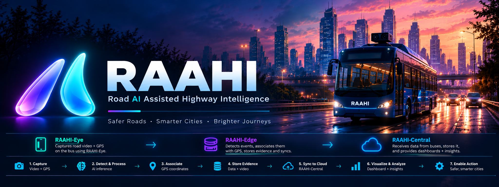
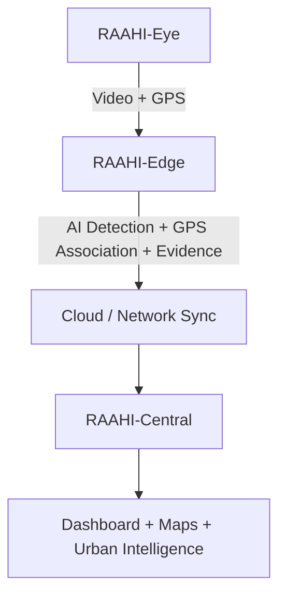
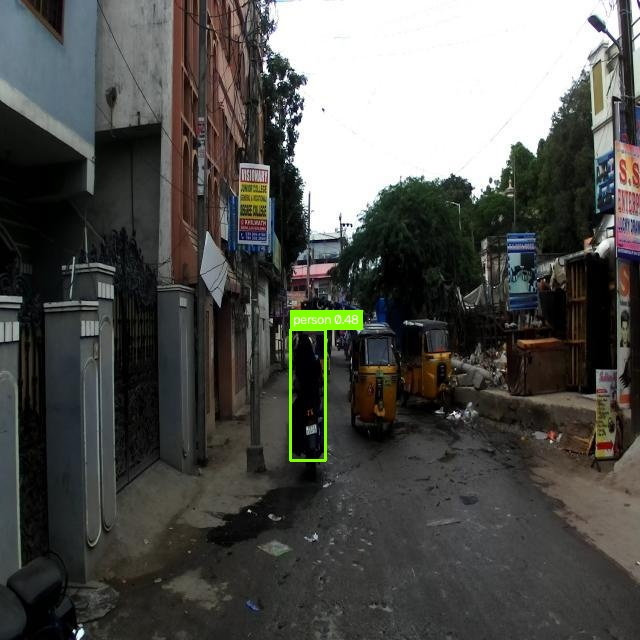

# RAAHI



## Overview

**RAAHI** (**R**oad **A**I **A**ssisted **H**ighway **I**ntelligence) is an AI-powered urban intelligence platform that uses public-transport vehicles as mobile sensing units to continuously monitor road networks. Instead of relying on expensive dedicated inspection vehicles or streaming bandwidth-heavy video to cloud servers, RAAHI leverages everyday municipal bus fleets to capture road observations at scale.

Forward-facing cameras and GPS sensors mounted on transit buses record road video and real-time positioning telemetry during regular passenger routes. Observations are processed on-device at the vehicle edge to detect road surface anomalies, preserve compact evidence recordings, and perceive vehicular traffic dynamics in real time.

When anomalies such as potholes or traffic congestion are identified, structured intelligence and targeted evidence recordings are synchronized with an authoritative central platform. Municipal engineers, public works authorities, and transit operators gain citywide visibility through interactive GIS dashboards, geospatial hazard mapping, and auditable incident inspection.

---

## What RAAHI Does

- **Automated Road Hazard Detection**: Detects potholes, road surface degradation, and physical hazards in real time using edge neural networks.
- **Vehicular Traffic Perception**: Tracks vehicle flow, estimates corridor occupancy, measures Vehicles Per Minute (VPM), and monitors traffic congestion states.
- **Deterministic GPS Telemetry Association**: Binds road anomalies to exact geospatial coordinates with satellite fix verification and geometry referencing.
- **Bandwidth-Optimized Evidence Slicing**: Retains video in a circular ring buffer; persists only targeted evidence clips (5 seconds pre-event + 10 seconds post-event) upon confirmed detection.
- **Offline-First Resilience**: Queues telemetry and evidence locally in SQLite on the vehicle when mobile connectivity drops; automatically drains and synchronizes when network access resumes.
- **Authoritative Spatial Deduplication**: Deduplicates multi-bus observations at the central platform using a 10-meter Haversine spatial radius, clustering repeat observations of the same pothole over time.
- **Evidence Storage & Archival**: Stages video evidence clips on local edge storage and backs them up to durable Google Drive storage with shareable playback links.
- **Interactive Civic Command Center**: Provides municipal engineers and fleet managers with real-time Leaflet GIS mapping, incident severity filtering, bus route tracking, and candidate event audit inspection.

---

## How RAAHI Works

RAAHI connects three specialized, autonomous components into a unified sensing and intelligence loop:

```
RAAHI-Eye  ──▶  RAAHI-Edge  ──▶  RAAHI-Central
```

- **[RAAHI-Eye](./RAAHI-Eye/README.md)**  
  Runs on the bus and captures road video + GPS telemetry. It acts as the mobile sensing client, streaming high-definition camera video via RTSP and streaming GPS coordinates via HTTP telemetry.

- **[RAAHI-Edge](./RAAHI-Edge/README.md)**  
  Runs on/near the bus, processes the video with AI, detects events, associates them with GPS, stores evidence locally, and synchronizes data. It houses the real-time perception models, circular video ring buffer, and offline SQLite synchronization queue.

- **[RAAHI-Central](./RAAHI-Central/README.md)**  
  Receives data from buses, stores and correlates the information, and provides dashboards/maps/insights. It acts as the central command platform, running spatial deduplication, maintaining authoritative state in MongoDB, and serving the interactive GIS dashboard.

These three components form a continuous, cohesive platform bridging physical vehicle sensing to central municipal decision-making.

---

## Architecture & Data Flow



---

## Repository Structure

```text
RAAHI/
├── RAAHI-Eye/
├── RAAHI-Edge/
├── RAAHI-Central/
├── RAAHI-Banner.png
├── .gitattributes
└── .gitignore
```

- **`RAAHI-Eye/`**: Android application for public transport buses. Captures camera video over RTSP and streams GNSS GPS coordinates.
- **`RAAHI-Edge/`**: Onboard edge perception unit. Runs real-time AI models (pothole and traffic detection), associates detections with GPS coordinates, extracts evidence video clips, and manages offline-resilient sync queues.
- **`RAAHI-Central/`**: Central cloud platform. Ingests data from the bus fleet, performs spatial deduplication (10m Haversine clustering), stores data in MongoDB, archives evidence to Google Drive, and serves the municipal GIS dashboard.
- **`RAAHI-Banner.png`**: Project visual identity banner.
- **`.gitattributes`**: Git LFS configuration tracking machine learning models and large binary assets across the monorepo.
- **`.gitignore`**: Monorepo-level ignore rules for environment files, caches, build artifacts, and virtual environments.

---

## Technology Stack

| Component | Focus Area | Technologies |
| :--- | :--- | :--- |
| **RAAHI-Eye** | Mobile Sensing & Telemetry | Kotlin, Jetpack Compose, CameraX, Google Play Services Fused Location, RootEncoder, MediaMTX |
| **RAAHI-Edge** | Edge Intelligence & Sync | Python 3.12, PyTorch, Ultralytics YOLO11n, ByteTrack, OpenCV, SQLite, asyncio, FastAPI |
| **RAAHI-Central** | Cloud Ingestion & Analytics | Node.js, Express.js, MongoDB Atlas, Mongoose, Google Drive API, Leaflet.js, React 18, Vite |
| **Infrastructure** | Transport & Protocols | RTSP, H.264, HTTP REST, Cloudflare Tunnels, Git LFS |

---

## Screenshots / Demo



*Example of real-time pothole detection with bounding box and confidence score.*

For complete dashboard views, camera streaming pipelines, and detailed system walkthroughs, refer to the individual component documentation below.

---

## Detailed Documentation

Comprehensive setup instructions, API references, configuration guides, and architecture specifications are maintained in each component directory:

- [RAAHI-Eye Documentation](./RAAHI-Eye/README.md)
- [RAAHI-Edge Documentation](./RAAHI-Edge/README.md)
- [RAAHI-Central Documentation](./RAAHI-Central/README.md)

---

## Smart India Hackathon

- **Event**: Smart India Hackathon
- **Problem Statement ID**: 26124
- **Problem Statement**: “AI-Powered Mobile Urban Intelligence Platform Using Public Transport Fleet”
- **Organization**: Bharat Electronics Limited

---

## Team

- **Lead Developer**: Ujjwal Raj ([@iUjjwalRaj](https://github.com/iUjjwalRaj))
- **Contributor**: Samar Kumar ([@samarkumar4355](https://github.com/samarkumar4355))

---

> Safer Roads. Smarter Cities. Brighter Journeys.
